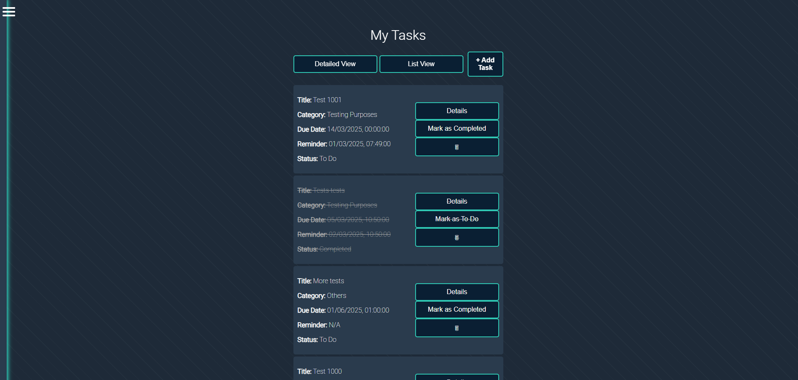

# DevSync Frontend

DevSync is a task management web application designed to help users stay organized and productive. Built with modern web technologies, it offers a seamless experience for managing tasks, reminders, and deadlines.

---

## Features
- User Authentication (Login/Registration)
- Task Creation, Editing, and Deletion
- Filter Tasks by Status (Pending, Completed)
- Organize Tasks by Categories
- Reminder and Due Date Management
- Responsive Design for Mobile and Desktop
- Interactive UI with Detailed and List Views

---

## Screenshots
### Dashboard


### Tasks Detailed View


### Tasks List View


### Task Creation Modal


### Sidebar Menu


---

## Tech Stack
- **Frontend:** React, React Router, SCSS
- **Backend:** Node.js, Express
- **Database:** MongoDB
- **Authentication:** JSON Web Tokens (JWT)
- **Toastify:** For sleek notifications
- **Custom Hooks & Components:** For optimized code structure

---

## Installation
1. **Clone the repository**
   ```bash
   git clone https://github.com/DennisIrias85/DevSync.git
   cd DevSync

2. Install dependencies
npm install

3. Set up environment variables
Create a .env file in the root directory with the following:

MONGO_URI=your_mongo_connection_string
JWT_SECRET=your_jwt_secret

4. Run the development server
npm run dev

**Usage**
- Login/Register to access the app.
- Navigate through the Dashboard to view tasks, create new tasks, or manage task categories.
- Click on the three-dot menu next to each task for quick actions like editing or deleting.
- Toggle between Detailed View and List View as per your preference.

**Upcoming Features**
- Drag-and-drop task reordering
- Recurring tasks for repetitive reminders
- Enhanced filtering options
- Dark/Light mode toggle

**Contributing**
Contributions are welcome! If you'd like to improve DevSync, please fork the repo, make changes, and submit a pull request.

**Contact**
For questions, feedback, or collaboration opportunities, feel free to reach out!

**License
This project is licensed under the [MIT License](./LICENSE).
